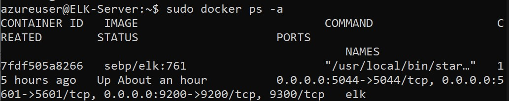

## Automated ELK Stack Deployment

The files in this repository were used to configure the network depicted below.


These files have been tested and used to generate a live ELK deployment on Azure. They can be used to either recreate the entire deployment pictured above. Alternatively, select portions of the pentest.yml file may be used to install only certain pieces of it, such as Filebeat.

  - [pentest.yml](Playbooks/pentest.yml)
  - [filebeat-playbook.yml](Playbooks/filebeat-playbook.yml)
  - [metricbeat-playbook.yml](Playbooks/metricbeat-playbook.yml)
  - [elk.yml](Playbooks/elk.yml)

This document contains the following details:
- Description of the Topology
- Access Policies
- ELK Configuration
  - Beats in Use
  - Machines Being Monitored
- How to Use the Ansible Build


### Description of the Topology

The main purpose of this network is to expose a load-balanced and monitored instance of DVWA, the D*mn Vulnerable Web Application.

Load balancing ensures that the application will be highly `available`, in addition to restricting `access`to the network.


### Load Balancer Protection aspect:
```
  -Load Balancers protect the availabilty of the servers, and will switch loads in between the servers so that no individual server is in distress and unable to respond to requests, and the queries are distributed among the servers in the Load balancer backend pool.
  ```
  ### Jump-Box Advantages 
  ```
  - Jump box offers security and isolates points of entry to the network. Only SSH can be used on the allowed orignating IP addresses.
```
Integrating an ELK server allows users to easily monitor the vulnerable VMs for changes to the `configuration` and system `log`.

### Filebest:
```
  Filebeat is a lightweight shipper for forwarding and centralizing log data. Installed as an agent on my servers, Filebeat monitors the log files or locations that I specify, collects log events, and forwards them either to Elasticsearch or Logstash for indexing.
  ```
### Metricbeat:

```
   Metricbeat takes the metrics and statistics that it collects and ships them to the output that I specify, such as Elasticsearch or Logstash. Metricbeat helps me monitor my servers by collecting metrics from the system and services running on the server, such as: Apache.
```
The configuration details of each machine may be found below.

_Note: Use the [Markdown Table Generator](http://www.tablesgenerator.com/markdown_tables) to add/remove values from the table_.

| Name     | Function | IP Address | Operating System |
|----------|----------|------------|------------------|
| Jump Box | Gateway  | 10.0.0.4   | Linux            |
| `Web1`    |  `Web Server`        |`10.0.0.7`            | `Linux`                 |
| `Web2`     | `Web Server`         | `10.0.0.6`           | `Linux`                 |
| `Elk Server`     | `Monitoring Solution`         |   `10.1.0.4`         | `Linux`                 |

### Access Policies

The machines on the internal network are not exposed to the public Internet. 

Only the `Jump-Box/ELK Server` machine can accept connections from the Internet. Access to this machine is only allowed from the following IP addresses:
```
- My Personal IP Address (The user)
```
Machines within the network can only be accessed by `Jump-Box`.

I allowe the Jump-Box to access my ELK VM with its IP address as follow:
```
- Jump-Box - 10.0.0.4
```
A summary of the access policies in place can be found in the table below.

| Name     | Publicly Accessible | Allowed IP Addresses |
|----------|---------------------|----------------------|
| `Jump Box` | `No (Only me)`             | `My home IP address`    |
|  `Web-1`        |         `Yes`            |      `10.0.0.4`                |
| `Web-2`         |            `Yes`         |            `10.0.0.4`          |
| `ELK-Server`       |         `No`            |               `My home IP address`      |

### Elk Configuration

Ansible was used to automate configuration of the ELK machine. No configuration was performed manually and 
the main advantage of automating configuration with Ansible is:
```
- To download the applications such as Docker and Python automatically without needing to SSH into each machine.
```
The playbook implements the following tasks:
```
- Install Docker
- Install Pip
- Install Python
- Create and download ELK container
- Adjust memory to 2.6BG RAM
```
The following screenshot displays the result of running `docker ps` after successfully configuring the ELK instance.




### Target Machines & Beats
This ELK server is configured to monitor the following machines:

```
  - Web-1
  - Web-2
```
I have installed the following Beats on these machines:

```
  - Filebeat
  - Metricbeat
```
These Beats allow me to collect the following information from each machine:
```
  - Filebeat looks up SSH logins, linux commands, and linux logins
  - Metric monitors for CPU, RAM, and network use
```
### Using the Playbook
In order to use the playbook, I will need to have an Ansible control node already configured. Assuming having such a control node provisioned: 

SSH into the control node and follow the steps below:
- Copy the `config` file to `/etc/` folder.
- Update the `hosts` file to include `the IPs of the webserver.`
- Run the playbook, and navigate to `the targeted machine` to check that the installation worked as expected.
*** ***
- Which file is the playbook? Where do you copy it? 
```
  - pentest.yml, elk.yml, filebeat-playbook.yml, metricbeat-playbook.yml
```

 I updated the `Host file` to make Ansible run the playbook on a specific machine. Also I need to  specify which machine to install the ELK server on versus which to install Filebeat on as follows:
  ```
  - In the ansible script, I must specify the hosts option in my script to determine where that script should install the specific programs to. For example, Web Servers, ELK and only IP entries of the Web servers entries to the host file will be updated.
  ``` 

I have navigated to the following URL in order to check that the ELK server is running:
```
  - http://20.106.143.244:5601/app/kibana#/home
```

The specific commands the user will need to run to download the playbook, update the files, etc.
```
-ls /etc/ansible/
-nano /etc/ansible/hosts
-nano /etc/ansible/ansible.cfg
-nano /etc/ansible/[playbook-name]
-ansible-playbook /etc/ansible/[playbook-name]
```